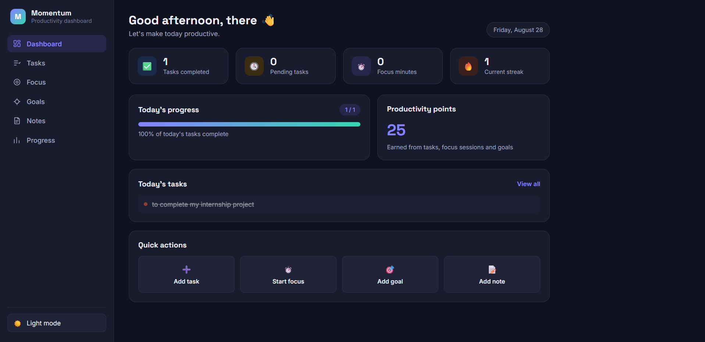

# Momentum — Personal Productivity Dashboard

## Overview

Momentum is a personal productivity dashboard built with plain HTML, CSS and JavaScript. It brings together daily tasks, a Pomodoro-style focus timer, daily goals, quick notes and a simple productivity progress view into a single, clean, single-page interface. All data is stored locally in the browser using `localStorage`, so the app works entirely offline with no backend, no build tools, and no external services.

The project was built with a modern SaaS-style visual direction: minimal, spacious, and professional, with subtle gamification (points, streaks and achievement badges) used only as light motivation — not as a game.

## Features

- **Dashboard** — a personalized greeting (morning/afternoon/evening, calculated dynamically), today's date, live statistics, a today's-progress bar, a preview of today's tasks, and quick-action shortcuts.
- **Task manager** — add tasks with a priority (Low / Medium / High), mark them complete, delete them, and filter by All / Pending / Completed. Tasks persist across refreshes.
- **Focus timer** — a Pomodoro-style countdown (25 minutes focus / 5 minutes break by default) with Start, Pause and Reset controls. Completing a focus session updates statistics and productivity points automatically.
- **Daily goals** — add, complete and delete short-term goals for the day, with a visual progress bar.
- **Notes** — create, edit, save and delete simple text notes that persist locally.
- **Progress view** — totals for completed tasks, focus sessions, focus minutes, current streak and productivity points, plus a simple CSS-based weekly bar chart (no charting library).
- **Achievements** — four subtle badges (First Step, Focused, Productive, Consistent) that unlock automatically when their conditions are met.
- **Productivity points** — a lightweight point system (+10 per task, +25 per focus session, +15 per goal) with safeguards against awarding duplicate points for the same item.
- **Daily streak** — increases when at least one productive action is completed on a new day.
- **Light / dark mode** — a theme toggle that remembers your preference.
- **Responsive design** — a full sidebar layout on desktop that collapses into a mobile-friendly slide-in menu on smaller screens.
- **Resilient storage** — reusable `loadData()` / `saveData()` helpers that handle missing or corrupted `localStorage` data without crashing the app.
- **Sample data** — a few realistic sample tasks and a sample goal are included on first launch, and can be deleted like any other item.

## Technologies Used

- HTML5
- CSS3
- Vanilla JavaScript
- Browser LocalStorage

No frameworks, libraries, build tools, or package managers are used.

## Project Structure

```
Momentum/
│
├── index.html
├── style.css
├── script.js
├── README.md
└── assets/
    └── favicon.svg
```

## How to Run Locally

1. Download or clone this repository.
2. Open the `Momentum` folder in VS Code (or any code editor).
3. Open `index.html` with the **Live Server** extension (or any local server).

The project can also be opened directly in a browser by double-clicking `index.html` — no server is required, since the app uses only static files and `localStorage`.

## Live Demo

[Live Demo](https://mayank87pandey-netizen.github.io/2025-29_MayankPandey_25scs1003002626_3rdsem_2CSE15/)

## Screenshots

Screenshots are not yet included in this repository. Once available, they can be added here, for example:

```

```

## Internship Project

This project was developed as a Web Development internship/portfolio project to demonstrate practical, framework-free frontend development skills.

## Future Improvements

The following are realistic ideas for future scope and are **not currently implemented**:

- Backend synchronization so data can be accessed across devices
- User authentication and per-user accounts
- Cloud data storage instead of `localStorage`
- More advanced productivity analytics and reporting
